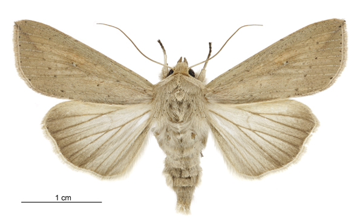

# hse25_individual_project

Организм [Mythimna separata](https://www.ncbi.nlm.nih.gov/datasets/genome/GCA_029852925.1/) (Совка восточная луговая).

Ноутбук [Google Colab](https://colab.research.google.com/drive/1SGxQcxJKDXLRxDQLl-CWKYmjHOMM1Ubk?usp=sharing)

|||
|-|-|
|Scaffold N50|22.7 Mb|
|Genes|17,542|
|Genome Size|688.4 Mb|
|PubMed|501|

Mythimna separata — один из основных вредителей зерновых культур в Азии, особенно в Китае, Индии и Юго-Восточной Азии. Его гусеницы наносят серьёзный урон посевам кукурузы, риса, пшеницы и сорго, способные мигрировать на большие расстояния и формировать многочисленные вспышки численности.
Вид предпочитает тёплый и влажный климат, с оптимальной температурой для развития от 25 °C до 30 °C. Повышение температуры может ускорять рост и размножение насекомого, влияя на продолжительность его жизненных стадий и увеличивая количество поколений в течение года.
Эпигенетические механизмы, такие как метилирование ДНК и регуляция экспрессии генов через микроРНК, играют важную роль в адаптации Mythimna separata к изменяющимся условиям среды. Исследования показывают, что популяции могут изменять экспрессию генов, связанных со стрессом и метаболизмом, в зависимости от температуры, доступности пищи и пестицидной нагрузки.

## Таблица семейство - ген

Полная версия таблицы в файле [domain_gene_results.csv](https://github.com/fallnlove/hse25_individual_project/blob/maindata/domain_gene_results.csv).

|Проверяемое семейство|Название гена|Координаты гена|
|-|-|-|
|14-3-3|KAJ8735462.1|+10361858:10363833|
|2-Hacid_dh|KAJ8737384.1|+34242577:34264270|
|2-Hacid_dh_C|KAJ8712513.1|+17353517:17364409|
|2OG-FeII_Oxy_2|KAJ8720224.1|-11439027:11440612|
|...|...|...|
|zf_Hakai|KAJ8732526.1|-6378255:6384629|
|ZZ|KAJ8709437.1|-18345092:18394398|

## Таблицы

|            |   quadruplex_sites count |   zhunt count |   zdnabert count |   quadruplex_sites % |   zhunt % |   zdnabert % |
|:-----------|-------------------------:|--------------:|-----------------:|---------------------:|----------:|-------------:|
| exons      |                     8447 |       1539661 |                54024 |           0.409135   | 0.49983   |            0.41948010 |
| introns    |                     7192 |       1288948 |                32343 |           0.348348   | 0.418439  |            0.2511336 |
| upstream   |                      554 |         84943 |                3182 |           0.0268333  | 0.0275756 |            0.0247073 |
| downstream |                      129 |         35522 |                541 |           0.00624818 | 0.0115317 |            0.0042007 |
| intergenic |                    12203 |       1545781 |                38698 |           0.591059   | 0.501816  |            0.3004783 |

|            |   quadruplex_sites region count |   zhunt region count |   zdnabert region count |   quadruplex_sites region % |   zhunt region % |   zdnabert region % |
|:-----------|--------------------------------:|---------------------:|------------------------:|----------------------------:|-----------------:|--------------------:|
| exons      |                            3665 |                12458 |                       37540 |                  0.208927   |         0.710181 |                   0.641106 |
| introns    |                            4003 |                39079 |                       11567 |                  0.0404703  |         0.395089 |                   0.19754 |
| upstream   |                             441 |                 5355 |                       3007 |                  0.0251397  |         0.305267 |                   0.051353 |
| downstream |                             124 |                 2350 |                       426 |                  0.00706875 |         0.133964 |                   0.007275 |
| intergenic |                            4198 |                12588 |                       6015 |                  0.241057   |         0.722825 |                   0.102723 |
